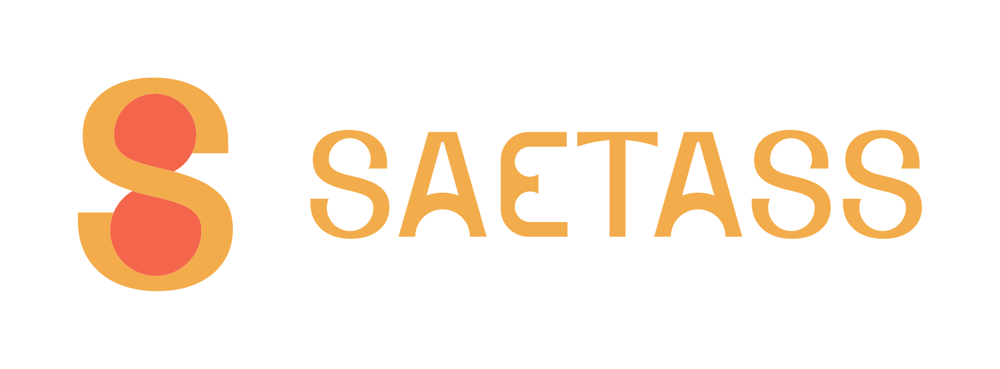
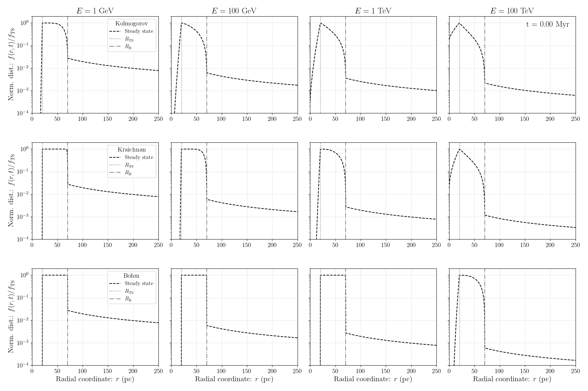

<div align="center">



<br/>
<br/>

**Solver for Astroparticle Equation of Transport Analysis in Spherical Symmetry**

A Python library for simulating cosmic-ray transport in spherically symmetric astrophysical environments using a finite volume method approach.

<br/>

<!-- ─────────────────────── Badges ─────────────────────── -->

[](https://doi.org/10.5281/zenodo.19468484)
[](https://github.com/jmgarciamorillo/SAETASS/actions)
[](https://codecov.io/gh/jmgarciamorillo/SAETASS)
[](https://saetass.readthedocs.io/en/latest/)
[](https://pypi.org/project/saetass/)<!-- [](https://pypi.org/project/saetass/) -->
[](https://www.repostatus.org/#active)
[](CONTRIBUTING.md)
[](LICENSE)
[](https://github.com/jmgarciamorillo/SAETASS/commits/main)
[](https://github.com/jmgarciamorillo/SAETASS/issues)
<!-- [](https://github.com/jmgarciamorillo/SAETASS/stargazers) -->


</div>

## Overview

**SAETASS** numerically solves the **astroparticle transport equation** in spherically symmetric astrophysical environments; this is, the fundamental equation governing the propagation and energy losses of energetic particles within astrophysical environments such as stellar wind bubbles.

The package decomposes the full transport equation into independent physical operators: **diffusion**, **advection**, **energy losses** and **source**. It evolves them via mathematically robust **operator-splitting schemes**. Each operator is implemented as a dedicated finite-volume solver, ensuring modularity, testability and physical transparency.

> **For comprehensive documentation**, visit the [SAETASS Documentation](https://saetass.readthedocs.io/en/latest/).


<div align="center">



</div>


## Key Features

| Feature | Description |
|---------|-------------|
| **Modular solvers** | Independent numerical schemes for advection, diffusion energy losses, and source injection; combined via operator splitting |
| **Flexible grids** | Dedicated grid object with support for diverse spatial and momentum grid configurations |
| **Physical accuracy** | Deep integration with `astropy.units` and `astropy.constants` for strict dimensional analysis |
| **Extensibility** | Plug in custom diffusion coefficients, velocity fields, loss functions and source terms |

## Installation

A quick simple installation to get started using SAETASS can be simply done via `pip`:

```bash
pip install saetass
```

This will install the latest stable version of SAETASS from [PyPI](https://pypi.org/project/saetass/).

> See the full [Installation Guide](https://saetass.readthedocs.io/en/latest/installation.html) for additional installation options and troubleshooting.

## Quickstart

For step-by-step guides to get started with SAETASS, check the [Tutorials](https://saetass.readthedocs.io/en/latest/tutorials/index.html) section of the [documentation](https://saetass.readthedocs.io/en/latest/).

For complete, more advanced examples, check the [Examples](https://saetass.readthedocs.io/en/latest/examples/index.html) section of the [documentation](https://saetass.readthedocs.io/en/latest/).


## Mathematical background

SAETASS solves the following **astroparticle transport equation** in spherically symmetric geometry:

$$\frac{\partial f}{\partial t}
    + \frac{1}{r^2}\frac{\partial}{\partial r}\left(r^2 u_\mathrm{w}f\right)
    + \frac{\partial}{\partial p}\left( \dot{p} f \right)
    = \frac{1}{r^2} \frac{\partial}{\partial r}
    \left(r^2 D\frac{\partial f}{\partial r}\right)
    + Q.$$

Where:
- $f(t,r, p)$ is the particle distribution function,
- $u_\mathrm{w}(t,r,p)$ is the advection (wind) velocity,
- $\dot{p}(t, r, p)$ is the rate of energy loss,
- $D(t, r, p)$ is the spatial diffusion coefficient,
- $Q(t, r, p)$ is the source term.

The equation is discretized using a **finite volume scheme** and solved by an **operator-splitting routine**, which decomposes the full PDE into simpler, independently solvable subproblems.

### References

<!-- TODO: Replace PLACEHOLDER_FOR_TECHNICAL_PAPER with the actual URL of the technical paper -->
> For a detailed derivation of the numerical schemes, see the [technical paper](PLACEHOLDER_FOR_TECHNICAL_PAPER).


## Citation

If you use SAETASS in your research, **please cite the technical paper** to acknowledge the development effort:

```bibtex
@article{PLACEHOLDER_FOR_TECHNICAL_PAPER,
  author  = {Garcia-Morillo, J. M.},
  title   = {SAETASS: Solver for Astroparticle Equation of Transport Analysis in Spherical Symmetry},
  journal = {XXXX},
  year    = {2026},
  volume  = {X},
  doi     = {10.XXXX/XXXXX}
}
```

For software-specific citations, you may use the **Zenodo DOI** [10.5281/zenodo.19468484](https://doi.org/10.5281/zenodo.19468484) citation:

```bibtex
@software{saetass_software,
  author       = {García-Morillo, José María and Menchiari, Stefano and López-Coto, Rubén},
  title        = "{SAETASS: Solver for Astroparticle Equation of Transport Analysis in Spherical Symmetry}",
  month        = apr,
  year         = 2026,
  publisher    = {Zenodo},
  doi          = {10.5281/zenodo.19468484},
  url          = {https://doi.org/10.5281/zenodo.19468484}
}
```

## Contributing

Contributions, bug reports and feature suggestions are welcome! Whether you want to fix a typo, improve a solver or add a new physical module: we'd love your help!

Please read the [Contributing Guidelines](CONTRIBUTING.md) and our [Code of Conduct](CODE_OF_CONDUCT.md) before getting started.

## License

SAETASS is released under the [BSD 3-Clause License](LICENSE).

## Acknowledgements

<div align="center">

SAETASS is developed within the [**VHEGA**](https://vhega.iaa.es) research group at the [**Instituto de Astrofísica de Andalucía (IAA-CSIC)**](https://www.iaa.csic.es), Granada, Spain.

<br/>

[](https://github.com/jmgarciamorillo)
[](mailto:jmorillo@iaa.es)
[](https://orcid.org/0009-0008-5232-349X)

</div>
